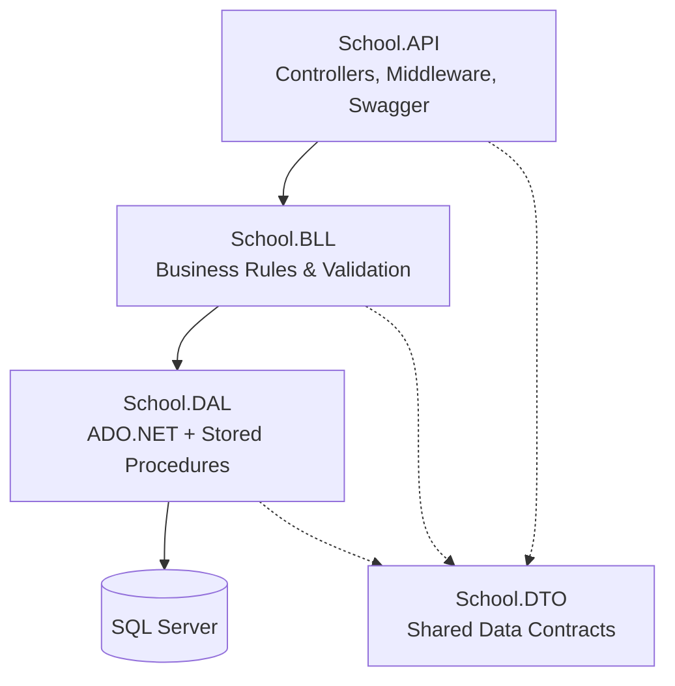

# School Management System — REST API

A layered, ASP.NET Core Web API for managing the day-to-day operations of a school: students, teachers, parents, classes, subjects, schedules, exams, grades, and attendance — built with a clean **DAL → BLL → API** architecture on top of raw ADO.NET and SQL Server stored procedures.

> This project was built as a hands-on exercise in layered architecture, dependency injection, and encapsulating real-world business rules (schedule conflicts, academic year boundaries, capacity limits) outside of the database and outside of the controllers.

---

## Table of Contents

- [Overview](#overview)
- [Architecture](#architecture)
- [Features](#features)
- [Tech Stack](#tech-stack)
- [Project Structure](#project-structure)
- [Getting Started](#getting-started)
- [API Documentation](#api-documentation)
- [Key Design Decisions](#key-design-decisions)
- [Known Limitations](#known-limitations)
- [Roadmap](#roadmap)
- [License](#license)

---

## Overview

The system models a full school domain: people can be students, teachers, or parents; students are enrolled in classes; classes have scheduled subjects taught by teachers in classrooms; exams are created per class-subject and students are graded against them; attendance is tracked per student per day.

Rather than exposing a thin CRUD wrapper around the database, the **Business Logic Layer (BLL)** enforces real domain rules — for example, a class cannot be scheduled into a classroom that's already booked at that time, a student can't be assigned a grade higher than an exam's total marks, and an exam date must fall within its class's academic year.

## Architecture

The solution follows a strict **3+1 layered architecture**, with each layer only depending on the one directly below it:



| Layer | Responsibility |
|---|---|
| **School.API** | HTTP entry point. Thin controllers that map requests to BLL calls, global exception handling middleware, Swagger/OpenAPI docs. |
| **School.BLL** | All business rules: input validation, existence checks, uniqueness checks, cross-entity consistency rules, password hashing. Depends only on DAL *interfaces*. |
| **School.DAL** | Data access via `Microsoft.Data.SqlClient`, calling SQL Server stored procedures exclusively (no raw inline SQL, no ORM). Depends only on DTOs. |
| **School.DTO** | Plain data contracts shared across all layers — no logic, no dependencies. |

Every DAL and BLL class is exposed through an interface and registered via `IServiceCollection` extension methods (`AddDAL()`, `AddBLL()`), so the whole dependency graph is wired through constructor injection and each layer can be mocked/replaced independently.

### Cross-cutting concerns

A single `ExceptionHandlingMiddleware` translates domain exceptions into consistent HTTP responses, so controllers never contain try/catch blocks:

| Exception | HTTP Status |
|---|---|
| `ArgumentException` / `ArgumentOutOfRangeException` | 400 Bad Request |
| `KeyNotFoundException` | 404 Not Found |
| `InvalidOperationException` | 409 Conflict |
| `UnauthorizedAccessException` | 401 Unauthorized |
| `SqlException` (FK violation, error 547) | 409 Conflict |
| Anything else | 500 Internal Server Error |

## Features

The API exposes 18 resource controllers covering the full school domain:

- **People & Identity** — `People`, `Users` (BCrypt-hashed passwords, password change flow)
- **Academic structure** — `Grades`, `Classes`, `Subjects`, `ClassSubjects` (teacher-subject-class assignments), `Classrooms`
- **Enrollment** — `Students`, `StudentStatuses`, `Parents`, `StudentParents`
- **Staffing** — `Teachers`, `TeacherSubjects`
- **Scheduling** — `Schedules`, with automatic conflict detection for classroom, teacher, and class double-booking
- **Assessment** — `ExamTypes`, `Exams`, `StudentGrades`
- **Attendance** — `Attendances`, `AttendanceStatuses`

### Notable business rules enforced in the BLL

- **Scheduling conflicts**: a classroom, teacher, or class cannot be double-booked for overlapping day/time slots (`ScheduleService`).
- **Academic year boundaries**: exam dates and attendance dates must fall within the class's academic year (Sep 1 → Aug 31), and only for active classes (`ExamService`, `AttendanceService`, `AcademicYearHelper`).
- **Class capacity**: a student can't be enrolled in a class that has reached its maximum capacity (`StudentService`).
- **Grading integrity**: a grade can't exceed an exam's total marks, must be `0` when the student is marked absent, and only one grade per student per exam is allowed (`StudentGradeService`).
- **Referential consistency**: every foreign key relationship (person ↔ student, person ↔ user, student ↔ class, etc.) is validated to exist *before* any write, and one-to-one relationships (e.g. one user account per person) are explicitly enforced.
- **Password security**: passwords are hashed with BCrypt before storage; plaintext passwords never touch the database.

## Tech Stack

- **.NET 8** / ASP.NET Core Web API
- **Microsoft.Data.SqlClient** — direct ADO.NET access, no ORM
- **SQL Server** — stored procedures for all data access (no inline/dynamic SQL)
- **BCrypt.Net** — password hashing
- **Swashbuckle (Swagger/OpenAPI)** — interactive API documentation
- **Dependency Injection** — built-in ASP.NET Core container, layer-scoped `AddDAL()` / `AddBLL()` extensions

## Project Structure

```
SchoolManagement/
├── SchoolManagement/         # School.API — Controllers, Middleware, Program.cs
│   ├── Controllers/
│   ├── Middlewares/
│   └── Program.cs
├── School.BLL/                # Business logic, validation, interfaces
│   ├── Interfaces/
│   ├── Common/                # PasswordHasher
│   ├── Helpers/                # AcademicYearHelper
│   └── *Service.cs
├── School.DAL/                # Data access via stored procedures
│   ├── Interfaces/
│   ├── Common/                # BaseData (connection + command factory)
│   └── *Data.cs
├── School.DTO/                 # Shared request/response contracts
│   └── */                      # grouped by domain (StudentsDTOs, ExamDTOs, ...)
└── Database/                    # SQL Server database backup
```

## Getting Started

### Prerequisites

- [.NET 8 SDK](https://dotnet.microsoft.com/download)
- SQL Server (LocalDB, Express, or full)
- A tool to restore the `.bck` database backup (SSMS or `sqlcmd`)

### Setup

1. **Clone the repository**
   ```bash
   git clone https://github.com/<your-username>/SchoolManagement.git
   cd SchoolManagement
   ```

2. **Restore the database**
   Restore `Database/SchoolDB.bck` into your local SQL Server instance (this includes all tables and stored procedures used by the DAL).

3. **Configure the connection string**
   In `SchoolManagement/appsettings.json` (or `appsettings.Development.json`), set:
   ```json
   {
     "ConnectionStrings": {
       "DefaultConnection": "Server=YOUR_SERVER;Database=SchoolDB;Trusted_Connection=True;TrustServerCertificate=True;"
     }
   }
   ```

4. **Run the API**
   ```bash
   cd SchoolManagement
   dotnet restore
   dotnet run
   ```

5. **Open Swagger UI**
   Navigate to `https://localhost:<port>/swagger` to explore and test all endpoints interactively.

## API Documentation

Full interactive documentation is generated automatically via Swagger/OpenAPI and served at `/swagger` in the Development environment. Every endpoint documents its expected success and error status codes via `[ProducesResponseType]`.

## Key Design Decisions

- **Stored procedures over an ORM**: every query and command goes through a named SQL Server stored procedure rather than inline SQL or EF Core, keeping data access explicit, auditable, and tunable directly in the database.
- **DTOs as the shared contract**: the same DTO types flow through DAL → BLL → API, avoiding duplicate mapping layers while keeping the domain model intentionally simple for this project's scope.
- **Validation lives in the BLL, not the database or the controller**: every business rule (existence, uniqueness, ranges, cross-entity consistency) is centralized in service classes, independent of how the API layer is implemented.
- **Interfaces everywhere**: both DAL and BLL classes are exposed via interfaces, making every layer mockable and unit-testable in isolation (see [Roadmap](#roadmap)).

## Known Limitations

This project is a work in progress. Documented here deliberately, rather than hidden:

- **No authentication/authorization yet.** `Users` exist with hashed passwords, but there is no login endpoint, no token issuance, and no `[Authorize]` enforcement on any controller — every endpoint is currently open. This is the top priority on the roadmap below.
- **Possible race conditions on uniqueness/availability checks.** Rules such as schedule conflict detection, exam duplication, and class capacity are implemented as a "check, then write" sequence in the BLL (e.g. `EnsureClassroomAvailableAsync` → `AddScheduleAsync`). Under concurrent requests, two calls could both pass the check before either writes, resulting in a double-booking. This needs to be closed with either a database-level constraint (unique index / `CHECK`), a transaction with an appropriate isolation level, or an application-level lock.
- **No automated tests.** The layered, interface-based design was built with testability in mind, but unit/integration tests haven't been written yet.
- **No logging.** There's no structured logging (e.g. `ILogger`/Serilog) in the middleware or services, which makes production debugging harder.
- **Stored procedures are only version-controlled as a binary backup** (`Database/SchoolDB.bck`), not as individual `.sql` scripts, making them harder to review or diff.

## Roadmap

- [ ] **Authentication & Authorization** — add a login endpoint issuing JWTs, role-based `[Authorize]` policies (Admin / Teacher / Parent), and refresh tokens.
- [ ] **Fix race conditions** — enforce scheduling, capacity, and uniqueness rules at the database level (unique constraints / transactions with proper isolation) so they hold under concurrent load, not just in application code.
- [ ] **Automated testing** — unit tests for the BLL (business rules are the highest-value target) and integration tests for the API.
- [ ] **Structured logging** — integrate `ILogger` / Serilog across middleware and services.
- [ ] **Version-controlled SQL** — extract stored procedures into `.sql` migration scripts committed to the repo.
- [ ] **Input validation via DataAnnotations** on DTOs to complement BLL-level checks and get automatic model-state validation at the API boundary.
- [ ] **CI pipeline** — build and test automation on every push/PR.

## License

This project is open for educational and portfolio purposes.
