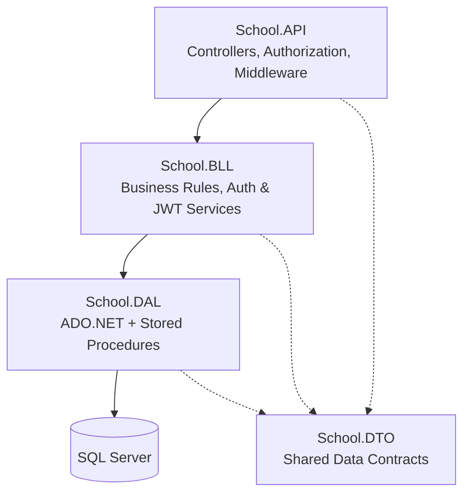

# School Management System — REST API

A layered ASP.NET Core Web API for managing the day-to-day operations of a school — students, teachers, parents, classes, subjects, schedules, exams, grades, and attendance — built on a clean **DAL → BLL → API** architecture with raw ADO.NET, SQL Server stored procedures, and a dynamic, permission-based authorization system.

> Built as a hands-on exercise in layered architecture, dependency injection, and implementing JWT-based authentication with a dynamic, permission-driven authorization system — not just CRUD — with real-world business rules (schedule conflicts, academic-year boundaries, capacity limits, ownership-based access) enforced outside the database and outside the controllers.

---

## Table of Contents

- [Overview](#overview)
- [Architecture](#architecture)
- [Authentication & Authorization](#authentication--authorization)
- [Features](#features)
- [Tech Stack](#tech-stack)
- [Project Structure](#project-structure)
- [Getting Started](#getting-started)
- [API Documentation](#api-documentation)
- [Key Design Decisions](#key-design-decisions)
- [Roadmap](#roadmap)
- [License](#license)

---

## Overview

The system models a full school domain: people can be students, teachers, or parents; students are enrolled in classes; classes have scheduled subjects taught by teachers in classrooms; exams are created per class-subject and students are graded against them; attendance is tracked per student per day.

Rather than exposing a thin CRUD wrapper around the database, the **Business Logic Layer (BLL)** enforces real domain rules — a classroom, teacher, or class can't be double-booked for overlapping time slots, a student can't be assigned a grade higher than an exam's total marks, an exam date must fall within its class's academic year, and a person can't simultaneously be registered as both a student and a staff member. On top of that, every endpoint is secured by a **dynamic, claims-based authorization system** that distinguishes between "view everything" and "view only what's yours" at the resource level — not just at the controller level.

## Architecture

The solution follows a strict **3+1 layered architecture**, with each layer only depending on the one directly below it:


```mermaid
flowchart TD
    A[School.API<br/>Controllers, Authorization, Middleware] --> B[School.BLL<br/>Business Rules, Auth & JWT Services]
    B --> C[School.DAL<br/>ADO.NET + Stored Procedures]
    C --> D[(SQL Server)]
    A -.-> E[School.DTO<br/>Shared Data Contracts]
    B -.-> E
    C -.-> E
```

| Layer | Responsibility |
|---|---|
| **School.API** | HTTP entry point. Thin controllers, custom authorization policy provider & handlers, global exception handling middleware, rate limiting, Swagger/OpenAPI docs. |
| **School.BLL** | All business rules: input validation, existence/uniqueness checks, cross-entity consistency rules, JWT generation, password hashing. Depends only on DAL *interfaces*. |
| **School.DAL** | Data access via `Microsoft.Data.SqlClient`, calling SQL Server stored procedures exclusively (no raw inline SQL, no ORM). Depends only on DTOs. |
| **School.DTO** | Plain data contracts shared across all layers — no logic, no dependencies. |

Every DAL and BLL class is exposed through an interface and registered via `IServiceCollection` extension methods (`AddDAL()`, `AddBLL()`), so the whole dependency graph is wired through constructor injection and each layer can be mocked/tested independently.

### Cross-cutting concerns

A single `ExceptionHandlingMiddleware` translates domain exceptions into consistent HTTP responses, so controllers never contain try/catch blocks:

| Exception | HTTP Status |
|---|---|
| `ArgumentException` / `ArgumentOutOfRangeException` | 400 Bad Request |
| `KeyNotFoundException` | 404 Not Found |
| `InvalidOperationException` | 409 Conflict |
| `UnauthorizedAccessException` | 401 Unauthorized |
| `SqlException` (FK violation, error 547) | 409 Conflict |
| Anything else | 500 Internal Server Error |

A fixed-window **rate limiter** (100 requests/minute per client IP) is applied globally ahead of the request pipeline.

## Authentication & Authorization

This is the core of the project: a **dynamic, permission-based RBAC system** built on ASP.NET Core's extensibility points rather than hardcoded `[Authorize(Roles = "...")]` checks.

- **JWT Authentication** — stateless bearer tokens signed with `HmacSha256`, carrying the user's identity, roles, and every individual permission as claims. Passwords are hashed with **BCrypt**.
- **Custom `IAuthorizationPolicyProvider`** — policies like `"Students.View.All"` or `"Students.Update"` aren't pre-registered; they're resolved dynamically at request time straight from the permission string, so adding a new permission never requires touching startup code.
- **Own vs. All permission scoping** — permissions follow an `Entity.Action.Scope` convention (e.g. `Students.View.Own` vs `Students.View.All`), letting the same policy engine express both "an admin who sees everything" and "a parent who sees only their own children" without duplicating endpoints.
- **Resource-based ownership authorization** — for `.Own`-scoped requests, custom `IAuthorizationHandler` implementations (`StudentOwnershipHandler`, `ParentOwnershipHandler`, `PersonOwnershipHandler`) resolve *actual* ownership against the database: a parent is authorized for a student's record only if a real `StudentParent` relationship exists, not just because they're logged in.
- **Two-layer checks where ownership matters** — for entities a non-admin user can legitimately have a personal stake in (Students, Teachers, Attendance, Grades, Parents, Users), the `[Authorize(Policy = "...")]` attribute is paired with an explicit resource-based check in the controller, so a "view your own record" permission is verified against the actual data, not just the presence of a claim.

## Features

The API exposes 25 resource controllers covering the full school domain:

- **People & Identity** — `People`, `Users` (password change with current-password verification), `Auth` (login/JWT issuance)
- **Access Control** — `Roles`, `Permissions`, `RolePermissions`, `UserRoles`
- **Academic structure** — `Grades`, `Classes`, `Subjects`, `ClassSubjects` (teacher-subject-class assignments), `Classrooms`
- **Enrollment** — `Students`, `StudentStatuses`, `Parents`, `StudentParents`
- **Staffing** — `Teachers`, `TeacherSubjects`
- **Scheduling** — `Schedules`, with automatic conflict detection for classroom, teacher, and class double-booking
- **Assessment** — `ExamTypes`, `Exams`, `StudentGrades`
- **Attendance** — `Attendances`, `AttendanceStatuses`
- **Reference data** — `Countries`, `Cities`

### Notable business rules enforced in the BLL

- **Scheduling conflicts**: a classroom, teacher, or class cannot be double-booked for overlapping day/time slots (`ScheduleService`).
- **Academic year boundaries**: exam dates and attendance dates must fall within the class's academic year (Sep 1 → Aug 31), and only for active classes (`ExamService`, `AttendanceService`, `AcademicYearHelper`).
- **Class capacity**: a student can't be enrolled in a class that has reached its maximum capacity (`StudentService`).
- **Grading integrity**: a grade can't exceed an exam's total marks, must be `0` when the student is marked absent, and only one grade per student per exam is allowed (`StudentGradeService`).
- **Role exclusivity**: a person can't be registered as both a student and a teacher/parent at the same time, while realistically allowing a teacher to also be a parent.
- **Referential consistency**: every foreign key relationship is validated to exist *before* any write, and one-to-one relationships (e.g. one user account per person) are explicitly enforced.

## Tech Stack

- **.NET 8** / ASP.NET Core Web API
- **JWT Bearer Authentication** with custom claims-based, resource-aware authorization
- **Microsoft.Data.SqlClient** — direct ADO.NET access, no ORM
- **SQL Server** — stored procedures for all data access (no inline/dynamic SQL)
- **BCrypt.Net** — password hashing
- **ASP.NET Core Rate Limiting** — fixed-window request throttling
- **Swashbuckle (Swagger/OpenAPI)** — interactive API documentation with JWT support built in
- **Dependency Injection** — built-in ASP.NET Core container, layer-scoped `AddDAL()` / `AddBLL()` extensions

## Project Structure

```
SchoolManagement/
├── SchoolManagement/          # School.API — Controllers, Authorization, Middleware, Program.cs
│   ├── Authorization/         # Policy provider, requirements, ownership handlers
│   ├── Controllers/
│   ├── Extensions/            # Auth, Authorization, Swagger, Rate Limiting setup
│   ├── Middlewares/
│   └── Program.cs
├── School.BLL/                 # Business logic, validation, interfaces
│   ├── Authentication/         # JwtService, AuthService
│   ├── Common/                 # ValidationHelper, EnsureHelper, PasswordHasher, AcademicYearHelper
│   ├── Interfaces/
│   └── *Service.cs
├── School.DAL/                  # Data access via stored procedures
│   ├── Common/                  # BaseData (connection + command factory)
│   ├── Interfaces/
│   └── *Data.cs
├── School.DTO/                   # Shared request/response contracts
│   └── */                        # grouped by domain (StudentsDTOs, ExamDTOs, ...)
└── Database/                       # SQL Server database backup
```

## Getting Started

### Prerequisites

- [.NET 8 SDK](https://dotnet.microsoft.com/download)
- SQL Server (LocalDB, Express, or full)
- A tool to restore the database backup (SSMS or `sqlcmd`)

### Setup

1. **Clone the repository**
   ```bash
   git clone https://github.com/Sherif-Osama/School-Management-System.git
   cd School-Management-System
   ```

2. **Restore the database**
   Restore `Database/SchoolDB.bak` into your local SQL Server instance — this includes all tables and stored procedures used by the DAL.

3. **Configure the connection string and JWT settings**
   In `SchoolManagement/appsettings.json`, set your connection string and JWT signing key:
   ```json
   {
     "ConnectionStrings": {
       "DefaultConnection": "Server=YOUR_SERVER;Database=SchoolDB;Trusted_Connection=True;TrustServerCertificate=True;"
     },
     "Jwt": {
       "Key": "your-own-secret-key",
       "Issuer": "SchoolAPI",
       "Audience": "SchoolAPIUsers",
       "ExpireMinutes": 30
     }
   }
   ```

4. **Run the API**
   ```bash
   cd SchoolManagement
   dotnet restore
   dotnet run
   ```

5. **Open Swagger UI**
   Navigate to `https://localhost:<port>/swagger`, authenticate via `POST /api/Auth/Login`, then click **Authorize** and paste the returned token to explore every endpoint interactively.

## API Documentation

Full interactive documentation is generated automatically via Swagger/OpenAPI and served at `/swagger` in the Development environment, with built-in JWT bearer token support so protected endpoints can be tested directly from the UI. Every endpoint documents its expected success and error status codes via `[ProducesResponseType]`.

## Key Design Decisions

- **Stored procedures over an ORM**: every query and command goes through a named SQL Server stored procedure rather than inline SQL or EF Core, keeping data access explicit, auditable, and tunable directly in the database.
- **Permission strings over hardcoded roles**: authorization checks against granular permission claims (`Students.View.Own`, `Users.Delete`, ...) resolved dynamically by a custom policy provider, rather than a fixed set of `[Authorize(Roles = "Admin")]` checks — new roles and role-permission assignments can be created through the `Roles`/`Permissions`/`RolePermissions` endpoints without adding new `[Authorize]` attributes for the `View.Own` vs `View.All` case specifically.
- **Authorization at two levels**: the policy provider guarantees a user holds *some* relevant permission before the request even reaches the controller; resource-based handlers then verify the user actually owns the specific record being requested. Neither check alone would be sufficient.
- **Validation lives in the BLL, not the database or the controller**: every business rule (existence, uniqueness, ranges, cross-entity consistency) is centralized in service classes, independent of how the API layer is implemented.
- **Interfaces everywhere**: both DAL and BLL classes are exposed via interfaces, making every layer mockable and unit-testable in isolation.

## Roadmap

- [ ] Automated test suite — unit tests for the BLL and integration tests for the authentication/authorization flow
- [ ] Pagination, filtering, and sorting on list endpoints
- [ ] Structured logging across middleware and services
- [ ] Refresh token support
- [ ] Version-controlled `.sql` migration scripts alongside the database backup
- [ ] CI pipeline for build/test automation on every push

## License

This project is open for educational and portfolio purposes.
