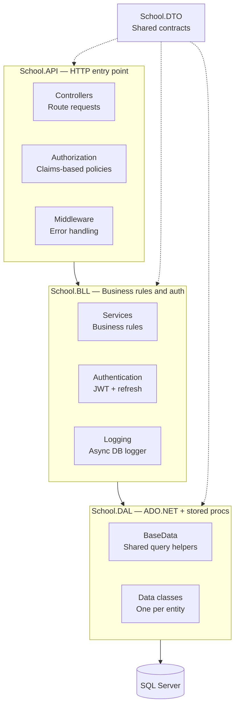

# School Management System — REST API

A layered ASP.NET Core Web API for managing the day-to-day operations of a school — students, teachers, parents, classes, subjects, schedules, exams, grades, and attendance — built on a **DAL → BLL → API** architecture with raw ADO.NET, SQL Server stored procedures, and a dynamic, permission-based authorization system.

---

## Table of Contents

- [Overview](#overview)
- [Architecture](#architecture)
- [Authentication & Authorization](#authentication--authorization)
- [Observability](#observability)
- [Testing](#testing)
- [Features](#features)
- [Tech Stack](#tech-stack)
- [Project Structure](#project-structure)
- [Getting Started](#getting-started)
- [API Documentation](#api-documentation)
- [Key Design Decisions](#key-design-decisions)
- [Known Limitations](#known-limitations)
- [Roadmap](#roadmap)
- [License](#license)

---

## Overview

The system models a full school domain: people can be students, teachers, or parents; students are enrolled in classes; classes have scheduled subjects taught by teachers in classrooms; exams are created per class-subject and students are graded against them; attendance is tracked per student per day.

Rather than exposing a thin CRUD wrapper around the database, the **Business Logic Layer (BLL)** enforces real domain rules — a classroom, teacher, or class can't be double-booked for overlapping time slots, a student can't be assigned a grade higher than an exam's total marks, an exam or attendance date must fall within its class's academic year, and a person can't simultaneously be registered as both a student and a staff member. Every endpoint is secured by a **dynamic, claims-based authorization system** that distinguishes between "view everything" and "view only what's yours" at the resource level, not just at the controller level.

## Architecture

The solution follows a strict layered architecture, with each layer depending only on the one directly below it:


```mermaid
flowchart TD
    subgraph API["School.API — HTTP entry point"]
        A1[Controllers<br/>Route requests]
        A2[Authorization<br/>Claims-based policies]
        A3[Middleware<br/>Error handling]
    end

    subgraph BLL["School.BLL — Business rules and auth"]
        B1[Services<br/>Business rules]
        B2[Authentication<br/>JWT + refresh]
        B3[Logging<br/>Async DB logger]
    end

    subgraph DAL["School.DAL — ADO.NET + stored procs"]
        C1[BaseData<br/>Shared query helpers]
        C2[Data classes<br/>One per entity]
    end

    API --> BLL --> DAL --> D[(SQL Server)]

    DTO[School.DTO<br/>Shared contracts]
    DTO -.-> API
    DTO -.-> BLL
    DTO -.-> DAL
```

| Layer | Responsibility |
|---|---|
| **School.API** | HTTP entry point. Thin controllers, custom authorization policy provider & handlers, global exception handling middleware, rate limiting, Swagger/OpenAPI docs. |
| **School.BLL** | All business rules: input validation, existence/uniqueness checks, cross-entity consistency rules, JWT + refresh-token generation, password hashing, database-backed logging pipeline. Depends only on DAL *interfaces*. |
| **School.DAL** | Data access via `Microsoft.Data.SqlClient`, calling SQL Server stored procedures exclusively (no inline SQL, no ORM). Depends only on DTOs. |
| **School.DTO** | Plain data contracts shared across all layers — no logic, no dependencies. |

Every DAL and BLL class is exposed through an interface and registered via `IServiceCollection` extension methods (`AddDAL()`, `AddBLL()`), so the dependency graph is wired entirely through constructor injection and every layer can be mocked in isolation — which is exactly how the unit test suite exercises the BLL (see [Testing](#testing)).

A recurring pattern across the DAL is a shared `BaseData` base class that centralizes connection handling and stored-procedure execution (`QueryListAsync`, `QuerySingleAsync`, `InsertAsync`, `ExecuteNonQueryAsync`, `ExecuteExistsAsync`, `ExecuteScalarStringAsync`). Every concrete `*Data` class only supplies the procedure name, its parameters, and a row-mapping function — the connection lifecycle, command setup, and reader iteration are never repeated.

### Cross-cutting concerns

A single `ExceptionHandlingMiddleware` translates BLL exceptions into consistent HTTP responses, so controllers never contain try/catch blocks:

| Exception | HTTP Status |
|---|---|
| `ArgumentException` / `ArgumentOutOfRangeException` | 400 Bad Request |
| `KeyNotFoundException` | 404 Not Found |
| `InvalidOperationException` | 409 Conflict |
| `UnauthorizedAccessException` | 401 Unauthorized |
| `SqlException` (foreign key violation, error 547) | 409 Conflict |
| Anything else | 500 Internal Server Error |

The same middleware also logs every `403 Forbidden` response with the requesting username and path, giving visibility into denied access attempts without adding logging code to individual controllers.

A fixed-window **rate limiter** (100 requests/minute per client IP, via `System.Threading.RateLimiting`) is applied globally ahead of the rest of the request pipeline.

## Authentication & Authorization

- **JWT Authentication** — stateless bearer tokens signed with `HmacSha256`, carrying the user's identity, roles, and every individual permission as claims. Passwords are hashed with **BCrypt**.
- **Refresh token rotation** — login issues a short-lived access token alongside a cryptographically random 64-byte refresh token. The refresh token itself is never stored in plain text: only its SHA-256 hash is persisted, alongside its own expiry and revocation state. `POST /api/Auth/RefreshToken` validates the token (not expired, not revoked), revokes it immediately, and issues a brand-new access/refresh pair — so a stolen refresh token can only ever be used once before it becomes invalid. Changing a password immediately revokes every refresh token issued to that user.
- **Custom `IAuthorizationPolicyProvider`** (`PermissionPolicyProvider`) — policies such as `"Students.View.All"` or `"Students.Update"` are not pre-registered in `Program.cs`; they are resolved dynamically at request time directly from the permission string, so adding a new permission never requires touching startup code.
- **`.Own` vs. `.All` permission scoping** — permissions follow an `Entity.Action.Scope` convention (e.g. `Students.View.Own` vs. `Students.View.All`). For a `.View.Own` policy, `PermissionPolicyProvider` builds an authorization requirement that succeeds if the caller holds *either* the `.Own` or the `.All` claim — the same policy name expresses both "an admin who sees everything" and "a parent who sees only their own children" without duplicating endpoints.
- **Resource-based ownership authorization** — for `.Own`-scoped requests, dedicated `IAuthorizationHandler` implementations resolve *actual* ownership against the database rather than trusting the claim alone:
  - `StudentOwnershipHandler` / `OwnershipService.IsOwnStudentAsync` — succeeds if the caller *is* the student (by `PersonID`), or is a parent with a real `StudentParent` link to that student.
  - `ParentOwnershipHandler` / `OwnershipService.IsOwnParentRecordAsync` — succeeds if the caller's `PersonID` matches the parent record's `PersonID`.
  - `PersonOwnershipHandler` — succeeds if the caller's `PersonID` claim matches the target `PersonID` directly.
- **Two-layer checks on ownership-sensitive endpoints** — for controllers where a non-admin user can legitimately have a personal stake in the data (`Students`, `Attendances`, `StudentGrades`, `Parents`, `Users`), the `[Authorize(Policy = "...")]` attribute is paired with an explicit `IAuthorizationService.AuthorizeAsync` call inside the action: if the caller doesn't hold the `.All` claim, the specific resource is checked against the ownership handler before the response is returned, and `Forbid()` is returned otherwise.

## Observability

Application logs are persisted to the database without blocking request handling:

- A custom `ILoggerProvider`/`ILogger` pair (`DatabaseLoggerProvider`, `DatabaseLogger`) captures log entries from anywhere in the app — including ASP.NET Core's own framework logging — and writes them into an in-memory `System.Threading.Channels.Channel<LogEntryDTO>` instead of hitting the database on the request thread.
- A `BackgroundService` (`LogBackgroundService`) continuously drains that channel and persists each entry through the DAL (`ILogData.AddLogAsync` → `SP_AddLog`), fully decoupled from the request/response cycle. Each write is wrapped in its own try/catch so a logging failure is reported to `Console.Error` and never bubbles up or crashes the background loop.
- The channel is bounded to 1,000 entries with a `DropOldest` policy, so a database slowdown degrades gracefully instead of exhausting memory or blocking API threads.
- The minimum captured log level is configurable via `Logging:Database:MinLevel` in `appsettings.json`.
- Security- and integrity-relevant events — forbidden access attempts, record deletions, and role/permission grants or revocations — are explicitly logged at `Warning` level from the middleware and from the relevant controllers.

## Testing

The BLL is covered by a dedicated **`School.Tests`** project using **xUnit** and **Moq**, with **524 test cases** across 26 test classes.

- **24 service test classes** — one per BLL service (`StudentServiceTests`, `ScheduleServiceTests`, `AttendanceServiceTests`, `AuthServiceTests`, `RolePermissionServiceTests`, and so on) plus **2 test classes for the shared `Common` helpers** (`EnsureHelperTests`, `ValidationHelperTests`).
- Each service is tested in true isolation: its DAL dependencies are mocked via `Moq`, so no test touches a real database or stored procedure.
- A shared `TestDataBuilders` class centralizes construction of valid request/response objects (with overridable parameters for the field under test), keeping test setup consistent and avoiding duplicated object-literal boilerplate across 24 test classes.
- Coverage goes beyond the happy path. For every write operation, tests assert the full failure surface the service is responsible for: missing/invalid input, not-found related entities, inactive-status violations, duplicate/uniqueness conflicts, out-of-range values, and propagation of a data-layer failure (e.g. an insert reporting zero rows affected still raises `InvalidOperationException`).
- Not yet covered: `CityService`, `CountryService` (simple reference-data lookups), and `JwtService` (thin token-generation wrapper).

## Features

The API exposes **26 controllers** covering the full school domain:

- **People & Identity** — `People`, `Users` (password change with current-password verification), `Auth` (login, refresh-token rotation, revocation)
- **Access Control** — `Roles`, `Permissions`, `RolePermissions`, `UserRoles`
- **Academic structure** — `Grades` (grade levels), `Classes`, `Subjects`, `ClassSubjects` (teacher-subject-class assignments), `Classrooms`
- **Enrollment** — `Students`, `StudentStatuses`, `Parents`, `StudentParents`
- **Staffing** — `Teachers`, `TeacherSubjects` (qualification mapping)
- **Scheduling** — `Schedules`, with conflict detection for classroom, teacher, and class double-booking
- **Assessment** — `ExamTypes`, `Exams`, `StudentGrades`
- **Attendance** — `Attendances`, `AttendanceStatuses`
- **Reference data** — `Countries`, `Cities`

### Notable business rules enforced in the BLL

- **Scheduling conflicts** — a classroom, teacher, or class cannot be double-booked for overlapping day/time slots (`ScheduleService`, checked against `IsClassroomAvailableAsync`, `IsTeacherAvailableAsync`, `IsClassAvailableAsync`).
- **Academic year boundaries** — exam dates and attendance dates must fall within the class's academic year (Sept 1 → Aug 31, derived from the `"YYYY-YYYY"` academic year string), and only for active classes (`ExamService`, `AttendanceService`, `AcademicYearHelper`).
- **Class capacity** — a student can't be enrolled in a class that has reached its maximum capacity (`StudentService.EnsureClassHasAvailableCapacityAsync`), re-checked on update only when the student's class actually changes.
- **Grading integrity** — a grade can't exceed an exam's total marks, must be exactly `0` when the student is marked absent, a student can only be graded for an exam belonging to their own class, and only one grade per student per exam is allowed (`StudentGradeService`).
- **Attendance integrity** — attendance can only be recorded for an active student in an active class, on a date no earlier than the student's enrollment date, with one record per student per day (`AttendanceService`).
- **Role exclusivity** — a person can't be registered as both a student and a teacher, or both a student and a parent, at the same time (a teacher *can* also be a parent).
- **Referential consistency** — every foreign key relationship is validated to exist before any write, and one-to-one relationships (one user account per person, one student/teacher/parent record per person) are explicitly enforced before insertion.

## Tech Stack

- **.NET 8** / ASP.NET Core Web API
- **JWT Bearer Authentication** with custom claims-based, resource-aware authorization and refresh-token rotation
- **Microsoft.Data.SqlClient** — direct ADO.NET access, no ORM
- **SQL Server** — stored procedures for all data access (no inline/dynamic SQL)
- **BCrypt.Net** — password hashing
- **System.Threading.Channels** — bounded, asynchronous pipeline for database-backed logging
- **ASP.NET Core Rate Limiting** — fixed-window request throttling
- **Swashbuckle (Swagger/OpenAPI)** — interactive API documentation with JWT bearer support built in
- **xUnit + Moq** — isolated unit tests for the BLL
- **Dependency Injection** — built-in ASP.NET Core container, layer-scoped `AddDAL()` / `AddBLL()` extensions

## Project Structure

```
SchoolManagement/
├── src/
│   ├── School.API/               # Controllers, Authorization, Middleware, Program.cs
│   │   ├── Authorization/        # Policy provider, requirements, ownership handlers
│   │   ├── Controllers/
│   │   ├── Extensions/           # Auth, Authorization, Swagger, Rate Limiting setup
│   │   └── Middlewares/
│   ├── School.BLL/                # Business logic, validation, interfaces
│   │   ├── Authentication/        # JwtService, AuthService
│   │   ├── Common/                 # ValidationHelper, EnsureHelper, PasswordHasher, AcademicYearHelper
│   │   ├── Logging/                # DatabaseLogger, DatabaseLoggerProvider, LogBackgroundService
│   │   ├── Interfaces/
│   │   └── *Service.cs
│   ├── School.DAL/                 # Data access via stored procedures
│   │   ├── Common/                  # BaseData (connection + command factory)
│   │   ├── Interfaces/
│   │   └── *Data.cs
│   └── School.DTO/                  # Shared request/response contracts, grouped by domain
├── tests/
│   └── School.Tests/
│       ├── Services/                # One test class per BLL service
│       ├── Common/                   # EnsureHelperTests, ValidationHelperTests
│       └── TestHelpers/              # TestDataBuilders
└── Database/                          # SQL Server database backup
```

## Getting Started

### Prerequisites

- [.NET 8 SDK](https://dotnet.microsoft.com/download)
- SQL Server (LocalDB, Express, or full)
- A tool to restore the database backup (SSMS or `sqlcmd`)

### Setup

1. **Clone the repository**
   ```bash
   git clone https://github.com/Sherif-Osama/School-Management-System.git
   cd School-Management-System
   ```

2. **Restore the database**
   Restore `Database/SchoolDB.bak` into your local SQL Server instance — this includes all tables and stored procedures used by the DAL.

3. **Configure the connection string and JWT settings**
   In `src/School.API/appsettings.json`, set your connection string and JWT signing key:
   ```json
   {
     "ConnectionStrings": {
       "DefaultConnection": "Server=YOUR_SERVER;Database=SchoolDB;Trusted_Connection=True;TrustServerCertificate=True;"
     },
     "Jwt": {
       "Key": "your-own-secret-key",
       "Issuer": "SchoolAPI",
       "Audience": "SchoolAPIUsers",
       "ExpireMinutes": 30,
       "RefreshTokenExpireDays": 7
     }
   }
   ```
   > For anything beyond local development, keep the JWT key and connection string out of source control — use `dotnet user-secrets` locally or an environment-based secret manager in any deployed environment.

4. **Run the API**
   ```bash
   cd src/School.API
   dotnet restore
   dotnet run
   ```

5. **Run the tests**
   ```bash
   cd tests/School.Tests
   dotnet test
   ```

6. **Open Swagger UI**
   Navigate to `https://localhost:<port>/swagger`, authenticate via `POST /api/Auth/Login`, then click **Authorize** and paste the returned access token to explore every endpoint interactively.

   A seeded admin account is included in the restored database backup for testing:
   ```json
   {
     "username": "AdminUser",
     "password": "12345678"
   }
   ```
   > This account is for local/demo testing only — holds full `.All` permissions and is not intended for production use.

## API Documentation

Full interactive documentation is generated automatically via Swagger/OpenAPI and served at `/swagger` in the Development environment, with built-in JWT bearer token support so protected endpoints can be tested directly from the UI. Endpoints document their expected success and error status codes via `[ProducesResponseType]`.

## Key Design Decisions

- **Stored procedures over an ORM** — every query and command goes through a named SQL Server stored procedure rather than inline SQL or EF Core, keeping data access explicit and auditable at the database boundary.
- **Permission strings over hardcoded roles** — authorization checks against granular permission claims (`Students.View.Own`, `Users.Delete`, ...) resolved dynamically by a custom policy provider, rather than a fixed set of `[Authorize(Roles = "Admin")]` checks. New roles and role-permission assignments can be created through the `Roles`/`Permissions`/`RolePermissions` endpoints without adding new `[Authorize]` attributes or redeploying code.
- **Authorization at two levels** — the policy provider guarantees a user holds *some* relevant permission before the request reaches the controller; resource-based handlers then verify the user actually owns the specific record being requested. Neither check alone is sufficient: a claim proves what a user is generally allowed to do, not what a specific record belongs to them.
- **Refresh tokens as single-use, server-tracked records** — rather than trusting a long-lived JWT or a purely stateless refresh scheme, every refresh token is persisted (as a hash) with its own expiry and revocation state, and rotated on every use, so token theft has a narrow, auditable window instead of an indefinite one.
- **Logging decoupled from the request pipeline** — writing a log entry to SQL Server on the same thread as an HTTP request would tie API latency to database health. Routing every log line through a bounded, in-memory channel and draining it from a dedicated background service keeps the two concerns independent.
- **Validation lives in the BLL, not the database or the controller** — every business rule (existence, uniqueness, ranges, cross-entity consistency) is centralized in service classes, independent of how the API layer or the database schema is implemented. Request DTOs intentionally carry no data-annotation attributes; the BLL is the single, unambiguous source of validation.
- **Generic data-access helpers over per-class boilerplate** — `BaseData` provides the connection lifecycle and stored-procedure execution once; every `*Data` class supplies only what's specific to it (procedure name, parameters, row mapping).
- **Interfaces everywhere** — both DAL and BLL classes are exposed via interfaces, which is what makes the BLL unit-testable in isolation from a real database (see [Testing](#testing)).

## Known Limitations

- **Concurrency**: rules that depend on a "check, then act" sequence across two separate calls to the database — schedule/classroom/teacher availability, class capacity, username/attendance/grade uniqueness — are not wrapped in a database transaction spanning both calls. Under concurrent requests, this leaves a narrow window for a race condition (e.g. two simultaneous enrollments both passing the capacity check before either insert commits). Acceptable for the current scope; would need transactional enforcement or DB-level constraints before any multi-user production use.
- **Database source control**: the schema and all stored procedures currently exist only inside `Database/SchoolDB.bak`, a binary SQL Server backup, rather than as versioned `.sql` scripts. This makes procedure logic hard to diff, review, or apply incrementally.
- **JWT permission staleness**: permissions are embedded in the access token at login time. If a role's permissions are revoked mid-session, the affected user keeps the old permissions until their current access token expires (up to `ExpireMinutes`).

## Roadmap

- [ ] Version-controlled `.sql` migration scripts alongside the database backup
- [ ] Transactional or DB-constraint-level enforcement for capacity/availability/uniqueness checks
- [ ] Integration tests for the authentication/authorization flow end-to-end
- [ ] Pagination, filtering, and sorting on list endpoints
- [ ] CI pipeline for build/test automation on every push

## License

This project is open for educational and portfolio purposes.